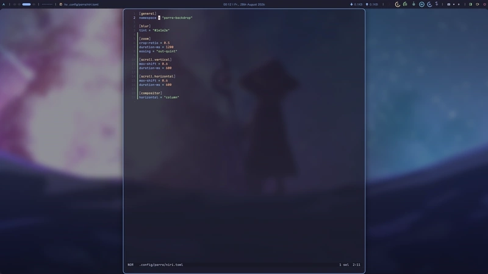

# parra

A wlr-layer-shell wallpaper daemon that supports compositor-driven effects:


> The illustration: [하얀새 - 星いっぱいの空とめぐみん (Pixiv)][showcase-source]

[showcase-source]: https://www.pixiv.net/artworks/77297453

- **vertical parallax scrolling**
- **horizontal parallax scrolling** (disabled by default)
- **blurring and tinting**
- **zoom-in/out**

and behaves exactly as expected for this type of program:

- **live wallpaper switching** without restarting or reinitializing the daemon
- **transition effect** while switching, and while a wallpaper arrives or leaves
- **transparent wallpapers**, blended over whatever the compositor draws below
- **automatic wallpaper restoration** at the next start

and with some extras:

- **configuration override** per monitor
- **control via IPC** for multiple actions and queries
- **a listenable event stream** that reports changes in status

and fully customizable, e.g. enable **horizontal scrolling** and some
tweaks to the animations, while pin the wallpaper still on eDP-1:



<details>
<summary>~/.config/parra/niri.toml</summary>

```toml
[general]
namespace = "parra-backdrop"

[blur]
tint = "#1e1e2e"

[zoom]
crop-ratio = 0.5
duration-ms = 1200
easing = "out-quint"

[scroll.vertical]
max-shift = 0.6
duration-ms = 600

[scroll.horizontal]
max-shift = 0.6
duration-ms = 600

[compositor]
horizontal = "column"

[output."eDP-1".compositor]
horizontal = "none"
vertical = "none"
```

</details>

> [!NOTE]
>
> Only niri and Hyprland are supported with compositor-driven effects so far.
> Support for more compositors may arrive in the future.

## Documentations

- [Installation](docs/install.md)
- [Usage](docs/usage.md)
- [Configuration](docs/config.md)
- [CLI](docs/cli.md)
- [Control protocol](docs/control-protocol.md)
- [Environment](docs/environment.md)

development:

- [Architecture](docs/architecture.md)
