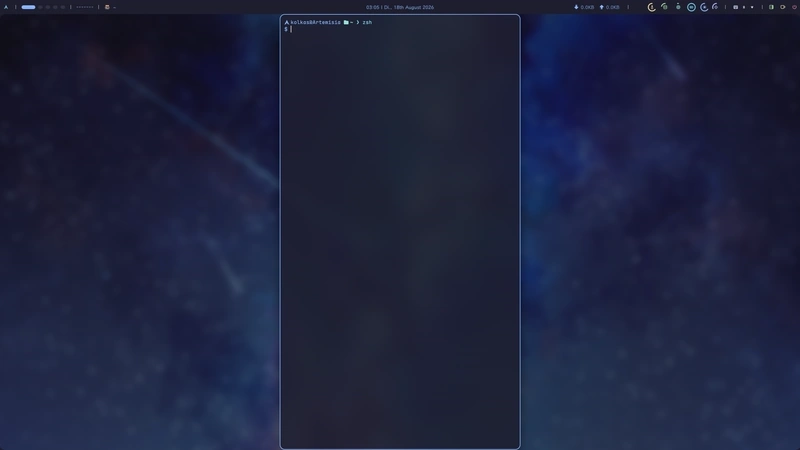

# parra



> The illustration: [하얀새 - 星いっぱいの空とめぐみん (Pixiv)][showcase-source]

[showcase-source]: https://www.pixiv.net/artworks/77297453

A wlr-layer-shell wallpaper daemon that supports compositor-driven effects:

- **vertical parallax scrolling** that follows the workspace
- **horizontal parallax scrolling** that follows the focusing column (disabled
  by default)
- **blurring and tinting** that follows window focus
- **zoom-in/out** that follows overview's close/open

and behaves exactly as expected for this type of program:

- **live wallpaper switching** without restarting or reinitializing the daemon
- **transition effect** when switching
- **automatic wallpaper restoration** at the next start
- **configuration override** per monitor

and with some extras:

- **control via IPC** including setting wallpapers, setting blurring, quering
  status, subscribing event-stream etc.
- **a listenable event stream** that describes every animation as it starts and
  reports changes in the status such as wallpapers and outputs

> [!NOTE]
>
> Only niri is supported so far. Support for more compositors might be added
> in the (near) future.

## Dependencies

Native libraries:

- libwayland (client)
- libwayland (EGL platform)
- libglvnd (EGL)

Buildtime:

- pkg-config
- rust toolchain (>=1.88)

Runtime:

- A supported compositor

These can be installed with apt on Debian/Ubuntu:

```bash
sudo apt install libwayland-dev libegl-dev pkgconf
```

or with pacman on Archlinux:

```bash
sudo pacman -S --needed wayland libglvnd mesa pkgconf
```

The rust toolchain can be installed with the distro's package manager (e.g.
`rustc` and `cargo` on Debian/Ubuntu), or with [rustup][rustup-home], which
often provides newer versions and more flexibility.

[rustup-home]: https://rustup.rs

## Build

This is a standard cargo project with a single binary output, so you can build
it normally with

```sh
cargo build --release --locked
```

and (optionally) install in the way you like, e.g.

```sh
sudo install -Dm755 -t /usr/local/bin target/release/parra
```

## Documentation

common:

- [Usage](docs/usage.md) — compositor integration and instructions for normal usage
- [Configuration](docs/config.md) — every key, defaults, per-monitor inheritance
- [CLI](docs/cli.md) — command syntax, global flags, exit codes
- [Control protocol](docs/control-protocol.md) — the socket, requests, responses, snapshots
- [Environment](docs/environment.md) — GPU selection, logging, where files go, and what is
  deliberately not configurable

development:

- [Architecture](docs/architecture.md) — what the crates are for and why they are split
