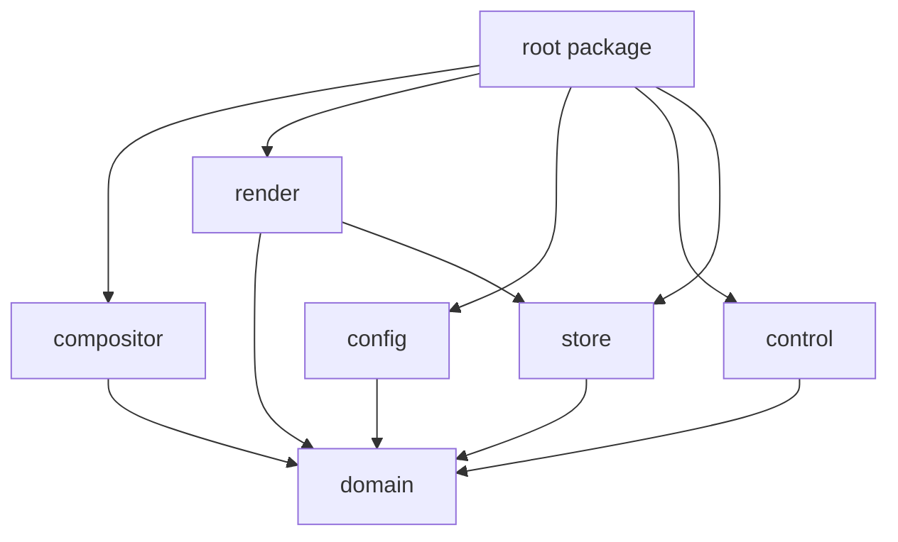
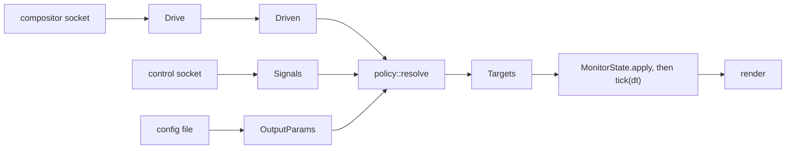

# Architecture

## Why the crates are split

Six library crates plus the root package, so that module boundaries are a compile error
rather than a convention.

The load-bearing property is what is _absent_: `render/Cargo.toml` does not list
`compositor`, so the renderer physically cannot learn that niri exists. The table below is
the whole of that rule. Only the root package sees every crate, and the decisions it makes
are the ones that need that view: what starts in which order, what happens when a
wallpaper will not load, and joining two crates that cannot see each other.

There are two of those joins. `OutputSnapshot::new` takes the GPU timings as an argument
because measuring them is the renderer's business and `control` cannot see `render`; and
the compositor's own config section is parsed there, because the file comes from `config`
and the schema from `compositor`, neither of which is allowed to know the other.

| Crate        | Knows                                                            | Must not know                                                                      |
| ------------ | ---------------------------------------------------------------- | ---------------------------------------------------------------------------------- |
| `domain`     | Identities, geometry, animation, resolved parameters, policy     | Wayland, OpenGL, compositors, files, sockets, the clock                            |
| `compositor` | How one compositor talks, and how to drive normalized channels from it | Config files, rendering, the control socket, why a channel value is wanted  |
| `render`     | Wayland, EGL/GLES, image decoding, how to draw a `MonitorState`  | Compositors, the control protocol, why a value is what it is, which GPU it runs on |
| `config`     | The TOML surface, merge rules, file watching                     | Rendering, compositors, IPC                                                        |
| `control`    | The request and response wire format, socket plumbing            | How to satisfy a request                                                           |
| `store`      | What the daemon writes down and where, and writing it atomically | Rendering, compositors, the config file, why a wallpaper was chosen                |
| root package | Startup order, lifecycle, what only exists once the crates meet  | Anything one crate could decide alone                                              |

`domain` depends only on `serde`. It has no clock: `tick(dt)` is fed elapsed time from
outside, which is what makes the animation and policy layers testable without a display.

## Data flow

## Design decisions that carry the performance budget

**Blur is baked once and interpolated.** The wallpaper is the bottom layer, so there
is nothing behind it: the blur is a static image effect. It is baked once with
dual-Kawase when the image or radius changes, at a quarter linear resolution, and
frames then interpolate between the sharp and blurred textures. A frame costs one
fullscreen pass with two texture samples regardless of radius.

The bake is keyed by wallpaper, radius and downscale, so two monitors share it when their
blur settings agree, and it is kept for as long as that wallpaper is shown rather than for
as long as it is visible: dropping it when an output loses focus would put the cost back
into the very interaction it was moved out of. It is not baked at all until an output
first asks to blur.

`radius` is measured in texels of the wallpaper texture rather than in logical pixels,
which is what lets one bake serve monitors at different scales. What that means for the
configured number is in [config.md](config.md#blur).

**The level chain is derived from the wanted radius.** Taps at level `i` reach `2^(i-1)`
source texels and independent passes add variance, so a chain's spread is a sum of squares
over its levels, counting the wider upsample kernel separately from the downsample one.
Inverting that gives the level count and tap offset. Measured against a CPU Gaussian on a
live session, two very different chains landed on their predictions:

| radius | levels / keep / offset | predicted sigma | measured sigma |
| ------ | ---------------------- | --------------- | -------------- |
| 32     | 3 / 2 / 2.68           | 10.67           | 11             |
| 96     | 4 / 2 / 3.85           | 32.0            | 32             |

**Scrolling moves a texture coordinate.** `domain::geometry::sample_rect`
turns image size, viewport size, zoom and scroll position into a UV rectangle. Panning
moves the rectangle; no pixels move, and nothing is re-uploaded.

**Idle costs zero frames.** A frame callback is requested only while some output reports
`Motion::Running`. When every animation settles, the daemon stops submitting. Each
output schedules itself, so a 60 Hz panel is never dragged along by a 180 Hz one.

Waking up again correctly takes six rules:

- _Drain before sleeping._ Presenting reads the Wayland connection itself, so a frame
  callback can land in our queue with nothing left on the descriptor for the event loop
  to notice. `Daemon::settle` loops until the queue is genuinely empty. Without it, about
  half of all runs stranded an animation part-way through.
- _Record the wait before presenting, not after._ The same read means this frame's own
  callback can be dispatched inside `eglSwapBuffers`, before it returns. Setting
  `awaiting_frame` afterwards overwrites that arrival, and the output then waits forever
  for a callback it has already consumed.
- _Restart the clock when targets change, not only when a frame is drawn._ Each output's
  clock advances inside `tick`, which only runs on a frame callback, which only happens
  while drawing. Across an idle gap it goes stale, so the first tick of the next
  animation is handed the whole idle period, jumps straight to the target and reports
  settled before anything was ever drawn at an intermediate value.
- _Present what the animation settled on._ An output whose last frame was mid-animation
  still owes one, because the value it settles on may be reached between two draws.
  Without `was_running` that final state is never shown and the wallpaper stays one
  target behind, permanently.
- _Remember frames that could not be submitted._ An output blocked on its previous
  callback marks itself dirty, so the frame is drawn once it is allowed to be. This
  matters most for an output nobody can see: a fully occluded surface gets very few
  callbacks, and the one it does get must still present the finished state.
- _Draw a change that started no animation._ `Motion::Running` is the daemon's whole
  evidence that anything changed, and it is true only of a move that takes time. A
  `duration-ms` of `0` snaps and has settled by the next pass; `scroll.<axis>.max-shift`
  and the blur's look are read where the frame is built and never animate at all. Both
  leave the state correct and the screen stale until some unrelated animation happens to
  carry it on, so `Daemon::resolve` and a reload call `Renderer::invalidate` instead.

The rule lives in `render::wayland::surface::Pacing` as one `plan` function over three
flags, where it is tested without a display.

**The budget is readable while it runs.** A frame is timed on the GPU with
`EXT_disjoint_timer_query`, and the result is read on a later frame, never on the one that
produced it: waiting for it would stall on the very thing being measured. A frame that
finds its predecessor still in flight goes untimed, which costs a sample and nothing else.
That number, the frame count, the texture footprint and the cold-start time all leave
through `state`, so checking a budget does not mean stopping the daemon to read a log.

Measured on the two monitors here, one 14 megapixel wallpaper on both: **142 to 186
microseconds** a frame, against a millisecond of budget. Sampling a full-resolution blur
instead of the quarter-scale bake costs 21% more.

With everything settled nothing is submitted, so the GPU drops to its lowest power state
-- 240 MHz here, from 2160 -- and the first frame of the next animation is measured at
that clock: **9 to 11 milliseconds**, then back to 150 microseconds as it ramps.

Cold start was the one budget over its target: first frame at 316 to 361 ms for a
2937x4796 wallpaper against a 200 ms target, and 188 ms for a 2242x1365 one. About 140 ms
of that is fixed -- connecting, binding the layer surfaces, EGL, shaders -- and the rest
was decoding, whose cost is set by the image.

Keeping the chosen wallpaper already resized removes that second half. A restart reads a
QOI file sized for the screen rather than decoding the original and resampling it, and
lands at 93 to 178 ms here, inside the target. QOI because the crate is already linked
for reading `.qoi` inputs, so it costs no dependency, and because decoding it is a
memcpy-shaped loop rather than an entropy decode plus a Lanczos3 pass.

The copy is written once per `parra set`, on the decode thread that already holds the
pixels, so the cost lands where a wallpaper was changing anyway. It is used again for as
long as it still covers what the outputs need, and re-made from the original when it does
not. Nothing waits for that: the old copy keeps drawing until the new one arrives.

The configured fallback is not kept this way. It is what shows before anything has ever
been chosen, and giving it a copy would mean a second thing deciding when a wallpaper's
identity changes.

**An image's alpha is carried, and its opacity is decided once.** A wallpaper with an
alpha channel shows what is behind the layer surface. Everything the composite and Kawase
passes touch is premultiplied, so a crossfade, a blur bake and the tint are all linear in
coverage as well as in colour, and an opaque frame comes out of the shader byte for byte
what it did before.

The buffer stays straight alpha through the decode, the Lanczos resize and the QOI copy,
and is premultiplied once on the decode thread just before the upload. Two reasons put it
there: `LINEAR` filtering interpolates texels before any shader runs, so straight alpha
fringes at every edge whatever the shader does about it; and a copy on disk written by any
version still reads, so nothing has to be migrated.

Opacity is decided twice, once per path a decode can take. The source decode reads it off
the image before the Lanczos resize, because a convolution over a constant alpha can land
a texel a step short of full, and it is skipped entirely for a format that carries no alpha
channel. A cached copy records nothing about the format it was made from, so reading one
walks the resized buffer every time; that walk lands on the same answer because the resize
renormalizes its kernels at the borders, which leaves a constant field exactly constant,
and anything short of constant was already translucent before the resize touched it. Both
walks stop at the first translucent pixel.

Either walk is what keeps the opaque region. Declaring the surface opaque lets the compositor
skip blending and consider the frame for direct scanout, and an alpha channel saying nothing
is common enough to be the case worth paying for: every PNG in the collection tested here
had one, and all of them were fully opaque. A frame gives the region up only while some
wallpaper it samples actually has a translucent pixel.

Measured against the same session, both builds run alternately so clock drift lands on
both: the crossfade, which fetches four textures and is the most exposed to the wider
arithmetic, came out at or below the old figures on every run; the blur came out within
five percent either way. Run-to-run spread on one unchanged build is about ten percent, so
nothing here is separable from noise. The walk itself is the one real cost: a source decode
of a 40.8 megapixel PNG with an alpha channel went from 237 to 256 ms, and one of a format
with no alpha channel did not move.

**A wallpaper arriving fades up, and the frame carries its own opacity for it.** An
output with nothing on it used to snap: a crossfade weighs two images against each other
and an arrival has one. Carrying alpha through the render path gave the other answer a
single image has, which is to fade up out of whatever the compositor draws below. What that
is depends on the setup rather than on anything here; [usage.md](usage.md#transparent-wallpapers)
says which.

The frame's opacity is a second animated value beside the crossfade weight, not the same
one reused. Reusing it looks free until a `parra set` lands part-way through an arrival,
where the rule that keeps whichever image is the more visible sends the frame either back
to nothing or straight to fully present. Two values let the crossfade run on its own clock
while the frame goes on arriving underneath it, and a 20-second arrival interrupted at 8
seconds measured within half a percent of the unbroken curve.

The cost is the opaque region, given up for the length of the transition exactly as a
translucent wallpaper gives it up: the compositor blends the surface and will not scan it
out directly. The pass itself does not move. The scale is one branch on a uniform and one
vec4 multiply, and across two alternating rounds of a 20-second arrival, with and without
it, the per-frame minima agreed to within three microseconds of 662 and were identical at
734 on the second output.

**A slot with nothing in it is a fully transparent wallpaper.** Unsetting the last
wallpaper used to leave it on screen: nothing was drawn for a slot holding none, so the
surface kept the last buffer it was given and the image stayed there for good. The fix is
not a case for emptiness but the removal of one. An output showing nothing draws a single
transparent texel, sampled wherever the geometry lands, and everything that already knew
how to fade a wallpaper works on it unchanged. It is also the answer to what `parra unset`
should look like, since setting a fully transparent image and unsetting one are the same
thing to whoever is looking at the screen.

The frame's opacity carries a departure as well as an arrival, with the image leaving held
in the second slot and the crossfade weight pinned to it. Crossfading into the blank layer
instead would have been shorter to write and breaks two of the four interruptions: an
`unset` part-way through an arrival leaves both values moving and multiplies into a bump,
and a `set` part-way through a departure meets the half-way rule with the blank layer as
the more visible half, dipping to the backdrop before it climbs. The rule that avoids both
is the one an arrival already follows -- the opacity is how present the frame is, and the
weight is which of two images it shows.

That second slot is released on the tick that lands the departure and not before, so the
image and its bake are held for exactly as long as they are drawn. The frame after it is
the blank layer, which is byte for byte the same image at zero opacity, so the rule that
gets a settled value onto the screen needs no case for this one.

One blur factor covers the whole frame and the blank layer is transparent at every level,
so what decides the factor is whichever wallpaper the frame is built around rather than the
current layer alone; without that, unsetting a blurred output pops the departing image to
sharp on its first frame. The cost is the opaque region, given up for good rather than for
the length of a transition, which is what a transparent wallpaper costs for the same reason.

**Geometry has one source.** The compositor reports which outputs exist; their size and
scale come from Wayland. Buffers are allocated at `ceil(logical * scale)` device pixels,
with the fractional scale taken from `wp_fractional_scale_v1` as an exact ratio in
120ths, so equality comparisons never drift.

**Nothing slow runs on the event loop's thread.** Decoding and resizing a wallpaper costs
about 0.2 s, which on that thread would be 0.2 s of frozen animation on every output. It
goes to a thread of its own, and the result comes back through a descriptor the loop
already watches. Until it lands, each output keeps drawing what it already had; a monitor
that has never had one draws nothing rather than a black frame.

The cache asks for a size and remembers the size it asked for, not the one that came
back. An image smaller than the screen is never enlarged, so it comes back short of the
request, and a cache comparing what came back would ask again on every pass for ever.

**The control socket never touches state.** Connections are served on threads of their
own; a request crosses to the event loop and its answer crosses back. That way a client
that connects and says nothing holds up nobody, no socket read can stall a frame, and
every mutation still happens on the one thread that owns the state.

Events go the other way under the same rule: the loop queues them for each subscriber and
the connection's own thread does the writing, so a client that has stopped reading fills a
bounded queue rather than a frame's worth of the loop's time. What happens when one fills
is in [control-protocol.md](control-protocol.md#events).

What is on that stream follows from the pacing above. Sampling an animation per frame
would mean a socket write per frame on the very path that was built to submit nothing
while idle, and a listener would still be a frame behind, which is why one is described
only as it starts.

**Work that belongs to no output binds an offscreen surface.** Uploading a texture and
baking a blur are not part of any monitor's frame, and a 1x1 pbuffer created at startup is
what they are made current on. The alternative, a surfaceless binding, is an extension
whose absence fails silently: the uploads would go nowhere.

**Shutting down has an order, and it is the reverse of one guess.** A native surface holds
a handle into the EGL display and a pointer into a Wayland surface, and `eglTerminate`
sends Wayland requests of its own to release what the driver allocated. So: native
surfaces first, then the EGL display, then the connection. The middle step is why `gl` is
declared before `wayland` in `Renderer`, fields being dropped in declaration order. Any
other order segfaults in the driver after the last log line.

## The four channels

A backend drives four values and nothing else: two scroll axes normalized to `0..=1`, and
two booleans for whether an output should be blurred and whether it should be zoomed out.
They are the animated channels themselves, so `policy::resolve` applies configuration to
them rather than deciding what they stand for.

The vocabulary stops there on purpose. `domain::Channels` is the whole of what a compositor
can say here, and a backend with something else to report changes `domain` before it
changes anything else. What the ceiling buys is that `Drive` carries no compositor's words,
so niri's workspaces and columns reach nothing outside its own backend.

**An axis is a position and a stride.** `domain::Stop` pairs where the axis sits with the
distance one of its stops covers, and that second number is there because `scroll.<axis>.max-shift`
is a distance in screens: turning it into a fraction needs to know how far a single move
goes, and a position alone cannot say. Only a backend knows what a stop is, so only a
backend can answer it.

That is a fifth number on the wire, and it is worth saying why it does not put the
discrete-indexed shape back. The stop **count** would: a compositor moving continuously has
nothing to put in it, and the `Option` it would need is the tell. A stride does not. It is
normalized like the position beside it, and `0` is a real answer -- *this axis pans
continuously and therefore never jumps* -- which is also where an undriven output already
sits. niri's tape, where one switch may cross several stops, and a compositor that swipes
exactly one workspace however far the jump, are both stated in it; the difference stays
inside each backend's own `progress`.

The configuration half does not travel the other way. `max-shift` is applied in
`geometry::sample_rect`, which is the only layer holding the image size, the viewport size
and the zoom the axis is actually at, and which runs per wallpaper slot and per frame. So a
resize, a hotplug, a wallpaper swap and the overview animation all come out right with
nothing to re-resolve, and `compositor` goes on reading no shared configuration at all.
Sending it a cap instead would mean a backend reading geometry it cannot see, at connect
time, and never hearing that any of it changed.

Everything is per output. That niri blurs at most one output at a time, and zooms every
output out together, are niri's rules rather than the boundary's: its backend states a
value for every output on every update, and nothing downstream assumes either. Two outputs
blurred at once is representable, because some other compositor will do it.

Which niri position moves which axis is `[compositor]` in its own config file. Centring an
axis is `horizontal = "none"` there, rather than a second switch in the shared parameters,
because otherwise two keys would say one thing.

Which *way* an axis runs is on the other side of that line, in `scroll.<axis>.invert`. A
backend reports where a position sits and says nothing about which end of the image that
should be; reading it backwards is a statement about the wallpaper, which every backend
would otherwise have to answer identically. So it is applied in `policy::axis`, beside
`travel`, and negates the same excursion about the centre that `travel` scales. Two
properties come from sharing that arithmetic: the centre is a fixed point, so an undriven
output does not jump when the key is toggled, and `travel` keeps its sign, so the stop
length `max-shift` measures in `MonitorState::limits` stays positive and the cap needs no
knowledge of direction at all.

The axes are configured apart because the compositor animates them apart, and one shared
curve could only ever match one of the two. Which niri animation each pairs with is in
[usage.md](usage.md#match-animations), and which Hyprland one in
[usage.md](usage.md#match-hyprlands-animations).

**A compositor with no position to report declares one instead.** Hyprland only names its
workspaces: they are global rather than per monitor, and it creates and destroys them as
they are used, so there is nothing it can be asked for that answers where a monitor sits.
`[compositor] span` in its own file is the answer, and it is a backend key rather than a
shared one because it is a fact about that compositor and no other. The backend turns a
name into a `Stop` before anything leaves it, so the ceiling above holds: `domain` never
learns the word workspace, and nothing downstream can tell the two compositors apart.

Counting the live workspaces instead was the alternative, and it is worse in a way that has
nothing to do with the boundary: the travel would change length whenever a workspace
appeared or went away, moving the wallpaper with no user action behind it. A workspace the
span does not list still has to land somewhere, which is why a numbered span clamps to its
nearest entry rather than centring: centre is a position like any other, and in
`["2", "4", "6"]` it is exactly where `"4"` sits.

Distance alone leaves one case open, and only history can settle it. Two entries equally far
off -- `"4"` between `"3"` and `"5"` -- go to whichever is nearer the workspace the monitor
was showing before, so the wallpaper holds its side of the gap instead of crossing it on the
way out and crossing back on the way home. The price is a position that is not a function of
the compositor's state alone: the backend remembers the workspace each monitor came from,
and a daemon started while a monitor already sits in a gap has nothing behind it to read and
falls back to the lower-numbered entry. The memory and the fallback both stay inside the
one tie the arithmetic cannot answer, and neither reaches above the `Stop` the backend
emits.

**The written order of a span decides where a stop sits and nothing else.** Reading it into
the answer as well would place workspace `"4"` differently under `["3", "1", "5"]` and
`["5", "1", "3"]`, which describe the same three stops, so the fallback goes by number and
a workspace listed twice is refused outright -- two stops carrying one number cannot be told
apart, and `"1"` and `"01"` are one number. What is left is an answer that depends on the
set of stops and the workspace behind it, and on nothing about how either was typed. The
thousand-workspace ceiling is a separate matter: it is there so a mistyped range is refused
instead of expanded, and a span that long already moves the wallpaper by about a pixel per
workspace.

**A channel a compositor cannot drive is left undriven, not faked.** Hyprland reports no
wider view of an output, so its backend never emits `ZoomedOut` and the channel stays where
an undriven output already sits. That is the fixed crop `zoom.crop-ratio` asks for, which is
also the headroom the parallax travels through, so the key goes on doing its main job with
its animation never firing. Reporting `false` explicitly on every update would say the same
thing at more cost, and there is nothing that could ever contradict it.

**Both axes are per output, and the horizontal one had to be made so.** Focus is global in
niri, so reading the column off the focused window answers for one monitor and leaves every
other one reporting nothing, which the backend's `progress` reads as centred.

The fix is that the column is remembered per workspace, in `Tracker::workspace_column`,
updated whenever the focus lands somewhere with a place in the scroll. An output then
reports the position of its own active workspace regardless of where the focus is. Two
consequences fall out of the same choice:

- Focusing a floating or fullscreen window holds the position instead of recentring the
  wallpaper. Such a window has no column, so there is nothing to record, and the
  workspace has not scrolled just because something is drawn over it.
- A remembered column that has since closed resolves to the nearest surviving one rather
  than to the centre, so closing a window never makes the wallpaper jump.

A workspace nothing has ever been focused on has no position to report, and centred is the
only neutral answer there.

Wallpaper transitions are carried the same way, from the two-slot `WallpaperSlot` in
`domain` through to `u_mix` in the composite shader. This is on by default, so the second
slot is normally occupied for the length of a fade and empty the rest of the time; with
the mode off it is dropped on the same call that sets the new wallpaper and costs nothing
at all.

The rule the crossfade follows is that an effect describes the output, not the image: a
transition replaces the subject while the viewer holds still. So both slots share one set
of effect values, and each is sampled through its own aspect-corrected rect. The outgoing
image goes on being animated as it fades, rather than sliding against the incoming one.

Two slots cannot hold three images, and a frame draws only layers it can sample at that
frame's blur level. Both bound the discontinuity at half an image; what a user sees when
either applies is in [config.md](config.md#transition).

## Noticing an edited configuration file

**A save is a burst, not an event.** Writing the file moves the old one away, creates the
name again empty, and only then fills it in. Every step is an inotify event, and reading
on the first of them reads a file that is missing or empty. Every key in the file format
is optional, so both parse cleanly and resolve to the built-in defaults: the daemon would
adopt them, log that the namespace disagrees, and put the real configuration back a
millisecond later when the next event arrived.

So an event records a deadline rather than triggering a read. `Daemon::on_config_event`
pushes it `SETTLED` (50 ms) ahead and arms one calloop timer, and the reload happens when
the file has been quiet for that long. One save is one reload whatever shape the save
takes. The queue is still drained on every event, because the watcher is registered level
triggered and re-resolves its watches from what it reads.

The event mask stays wide for the same reason. `CREATE` is what `symlink` and `link`
produce, and they produce nothing else, so dropping it would hide a dotfile manager
re-pointing a link; the burst is what made it dangerous, and the deadline is where that
is answered.

**A watch is on an inode, not a path.** `inotify_add_watch` resolves symlinks when the
watch is added, so a linked configuration *directory* needs nothing special. A linked
*file* does: the writes land in the directory the link leads to, which is not the one the
name lives in. `config::watch::places` returns both, `Watcher` holds a `(watch, name)`
pair for each, and every event that is ours re-resolves them, so a link re-pointed at a
new generation is followed to its new target.

**A watch that dies stays dead.** Removing the watched directory outright, as a generation
switch or a restore does, makes the kernel drop the watch; nothing arrives afterwards and
nothing notices. `parra reload` over the socket re-reads the file regardless of the
watcher, and a restart rebuilds it, so the recovery is a command rather than machinery
that runs on every daemon forever.

## Putting the record back

`--no-save` shows a wallpaper without writing it down, and `parra restore` is the way back
from one. It re-applies the store's own copy of the record rather than re-reading
`state.toml`, because the two are the same thing: every path that changes the record
mutates that copy and then writes the file, and a set that is not to be remembered goes
through `Store::transient`, which allocates an epoch and records nothing. A re-read would
buy recovery from a `save` that already failed loudly, and would cost a parse that can
fail, a version mismatch that would silently empty the record, and an epoch counter to
reconcile. Nothing else writes the file.

**The slots are emptied before the record is applied.** A restore has to drop a wallpaper
the record does not name, which is exactly the `--no-save` unset case, and applying entries
alone could only overwrite. That makes the order the entries come in load-bearing: applying
the broadcast entry clears the per-output ones, the way a broadcast always does, so it has
to be applied first. `State::entries` yields it first, and a test says so.

**A restored wallpaper keeps the identity it was recorded with**, epoch included, so
restoring what is already on screen compares equal and starts nothing. That also makes it
the only wallpaper change with no decode behind it, since `set` always allocates a fresh
epoch. What redraws it is `Renderer::draw` comparing what it last presented against the
slot, not the animation, which there is none of.

## Extension seams

Adding a compositor means adding `compositor/src/backends/<name>/`, its arms in
`backends/mod.rs`, and a `<name>.example.toml`. No other crate changes, and no crate but
`compositor` names the backend at all: `AVAILABLE`, `detect`, `Params` and `connect` are
what everything else works through.

That holds only while the new backend fits the four channels above. One that needs a fifth
changes `domain` first and then everything downstream of it, which is what happened the
last time this was tried. The ceiling is written down here rather than promised away.

Hyprland was the second attempt and the test of it, and it fit. What it has that niri does
not is a declared span, which turned out to be a setting rather than a channel: it belongs
to one backend, it is read where that backend's other settings are, and the position it
produces leaves as the same `Stop` any other compositor reports. The first attempt put it in
`domain` and grew a `Workspace` vocabulary to carry it, which is the shape this seam exists
to avoid.

A backend that has to ask questions asks them sparingly. Hyprland's event socket carries
changes only and never restates the world, so its backend reads a snapshot over the request
socket at every connect, and again for the three events that leave a monitor showing
something nothing stated: a workspace moved to another monitor, a workspace renumbered, and
a monitor plugged in. Nothing on the event path asks, so no burst of compositor activity can
become a queue of requests. That socket serves one connection at a time, and holding one
open blocks every other client of it and the compositor's own handling of them: measured at
three seconds of a wedged compositor for a connection held silent for three, against eight
milliseconds for the same request unobstructed. So it is opened and closed around each
request rather than kept.

The backend's own settings are its `Params` type, deserialized from the `[compositor]`
table. `config` carries that table across without reading it, and `compositor` takes a
`Deserializer` rather than a file format, so neither has to know the other exists. Two
`cargo tree` checks keep that honest: `config` must not reach `compositor`, and
`compositor` must not reach `toml`.

Where the wallpaper sits when the overview opens is the compositor's decision, not this
program's. niri draws layer surfaces inside each workspace thumbnail by default, and puts
them behind the overview only for surfaces a `layer-rule` selects, matched on the
namespace. So the namespace is the seam, and `[general] namespace` is where a user says
it. Its default is the program's own name.

## Choosing a GPU is not part of this

The renderer builds its display with `eglGetPlatformDisplay(EGL_PLATFORM_WAYLAND_KHR, ...)`
on the `wl_display` the compositor gave it, and its surfaces with `wl_egl_window_create`.
Device selection, buffer allocation and cross-GPU import are the EGL implementation's job
on that path, and the compositor's dmabuf feedback tells it which device each surface
should use. Hand-rolled dmabuf allocation would mean reimplementing that feedback handling.
Which variables a user sets instead is in
[environment.md](environment.md#choosing-a-gpu).

## Choosing a wallpaper is not part of this

Pickers, thumbnail caches, palette extraction and rotation are all out of scope and
deliberately decoupled. A path arrives from the config file or over the control socket.

## Measured footprint

From a release build showing one 4000x2250 wallpaper on both monitors, idle:

|                   | Value              | Note                                                                        |
| ----------------- | ------------------ | --------------------------------------------------------------------------- |
| Frames while idle | 0                  | 2 frames total, one per output, then nothing for 76 s                       |
| CPU while idle    | 0 jiffies over 3 s | The loop blocks with no timeout                                             |
| RSS               | 195 MB             |                                                                             |
| PSS               | 86 MB              | Most of RSS is shared driver mappings                                       |
| Own heap          | 24 MB              | The only part this program controls                                         |
| Driver mappings   | 146 MB             | NVIDIA shader compiler 68, LLVM 24, EGL core 21, `nvidiactl` 18, gallium 16 |

The driver figure is the floor for any EGL client on a machine whose two monitors hang
off different GPUs: both the NVIDIA and the Mesa stacks get loaded. It is not something
this program can trade away, which is why `PSS` and own-heap are the numbers worth
watching. For scale, the quickshell setup this replaces measured 506 MB RSS and 412 MB
PSS.
