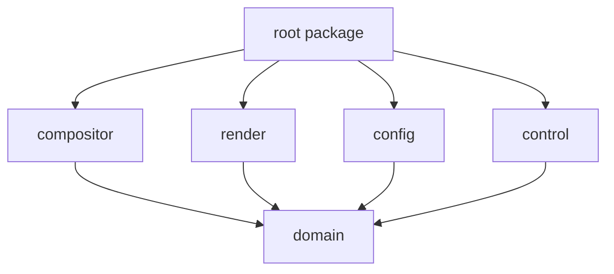
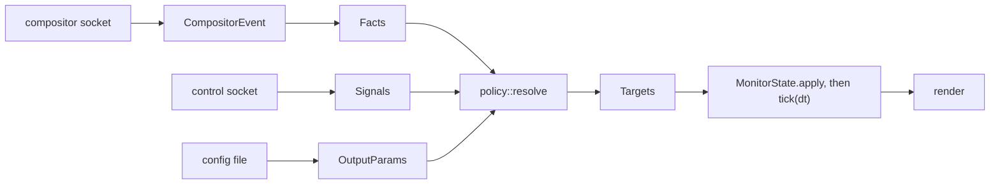

# Architecture

## Why the crates are split

Five library crates plus the root package, so that module boundaries are a compile error
rather than a convention.

The load-bearing property is what is _absent_: `render/Cargo.toml` does not list
`compositor`, so the renderer physically cannot learn that niri exists. `compositor`
cannot reach a rendering API. Neither can see `control`. Only the root package sees all
of them, and it holds no logic of its own.

| Crate        | Knows                                                           | Must not know                                                                      |
| ------------ | --------------------------------------------------------------- | ---------------------------------------------------------------------------------- |
| `domain`     | Identities, geometry, animation, resolved parameters, policy    | Wayland, OpenGL, compositors, files, sockets, the clock                            |
| `compositor` | How one compositor talks and how to normalize what it says      | Blur, scroll offsets, config, rendering, the control socket                        |
| `render`     | Wayland, EGL/GLES, image decoding, how to draw a `MonitorState` | Compositors, the control protocol, why a value is what it is, which GPU it runs on |
| `config`     | The TOML surface, merge rules, file watching                    | Rendering, compositors, IPC                                                        |
| `control`    | The request and response wire format, socket plumbing           | How to satisfy a request                                                           |
| root package | How to wire the above together                                  | Anything else; it holds no logic                                                   |

`domain` depends only on `serde`. It has no clock: `tick(dt)` is fed elapsed time from
outside, which is what makes the animation and policy layers testable without a display.

That table is the one place these boundaries are written down. The code states them only
where breaking one would be an easy mistake to make.

## Data flow

### Where blur is decided, and why not earlier

The obvious layering is: the compositor adapter reports "is focused", derives "should
blur", and the renderer acts on it. That does not work, because blur also depends on
whether something else is drawing over the wallpaper, and that signal arrives on the
control socket. A `compositor` crate that decided blur would have to know about the
control socket, which is exactly the coupling the split exists to prevent.

So the merge point moved up one level, to `domain::policy`. `compositor` reports facts,
`control` reports signals, and `policy::resolve` is the single function that turns both
plus configuration into targets. The layering is no deeper; each layer just does less.

## Design decisions that carry the performance budget

**Blur is baked, not computed per frame.** The wallpaper is the bottom layer, so there
is nothing behind it: the blur is a static image effect. It is baked once with
dual-Kawase when the image or radius changes, at a quarter linear resolution, and
frames then interpolate between the sharp and blurred textures. A frame costs one
fullscreen pass with two texture samples regardless of radius.

The bake is keyed by wallpaper, radius and downscale, so two monitors share it when their
blur settings agree, and it is kept for as long as that wallpaper is shown rather than for
as long as it is visible: dropping it when an output loses focus would put the cost back
into the very interaction it was moved out of. It is not baked at all until an output
first asks to blur.

`radius` is measured in texels of the wallpaper texture. That texture is decoded at the
buffer size times the deepest zoom, so at rest one texel is one device pixel and the
configured number is the blur's extent on screen. Choosing texels over logical pixels is
what lets one bake serve monitors at different scales.

**The level chain is derived, not tuned.** Taps at level `i` reach `2^(i-1)` source texels
and independent passes add variance, so a chain's spread is a sum of squares over its
levels, counting the wider upsample kernel separately from the downsample one. Inverting
that gives the level count and tap offset for a wanted radius. Measured against a CPU
Gaussian on a live session, two very different chains landed on their predictions:

| radius | levels / keep / offset | predicted sigma | measured sigma |
| ------ | ---------------------- | --------------- | -------------- |
| 32     | 3 / 2 / 2.68           | 10.67           | 11             |
| 96     | 4 / 2 / 3.85           | 32.0            | 32             |

An earlier chain that never went deeper than the level it kept predicted 4.22 and measured
4, which is what established that the upsample kernel had to be counted separately.

**Scrolling is a texture coordinate, not a transform.** `domain::geometry::sample_rect`
turns image size, viewport size, zoom and scroll position into a UV rectangle. Panning
moves the rectangle; no pixels move, and nothing is re-uploaded.

**Idle costs zero frames.** A frame callback is requested only while some output reports
`Motion::Running`. When every animation settles, the daemon stops submitting. Each
output schedules itself, so a 60 Hz panel is never dragged along by a 180 Hz one.

Sleeping while idle is the cheap part. Waking up again correctly is where every bug
lived, and each of the following cost a real stall before it was understood:

- _Drain before sleeping._ Presenting reads the Wayland connection itself, so a frame
  callback can land in our queue with nothing left on the descriptor for the event loop
  to notice. `Daemon::settle` loops until the queue is genuinely empty. Without it, about
  half of all runs stranded an animation part-way through.
- _Record the wait before presenting, not after._ The same read means this frame's own
  callback can be dispatched inside `eglSwapBuffers`, before it returns. Setting
  `awaiting_frame` afterwards overwrites that arrival, and the output then waits forever
  for a callback it has already consumed.
- _Restart the clock when targets change, not only when a frame is drawn._ Each output's
  clock advances inside `tick`, which only runs on a frame callback, which only happens
  while drawing. Across an idle gap it goes stale, so the first tick of the next
  animation is handed the whole idle period, jumps straight to the target and reports
  settled before anything was ever drawn at an intermediate value.
- _Present what the animation settled on._ An output whose last frame was mid-animation
  still owes one, because the value it settles on may be reached between two draws.
  Without `was_running` that final state is never shown and the wallpaper stays one
  target behind, permanently.
- _Remember frames that could not be submitted._ An output blocked on its previous
  callback marks itself dirty, so the frame is drawn once it is allowed to be. This
  matters most for an output nobody can see: a fully occluded surface gets very few
  callbacks, and the one it does get must still present the finished state.

Three of those five were wrong at some point in the same boolean expression, so the rule
now lives in `render::wayland::surface::Pacing` as one `plan` function over three flags,
where it is tested without a display.

**The budget is readable while it runs.** A frame is timed on the GPU with
`EXT_disjoint_timer_query`, and the result is read on a later frame, never on the one that
produced it: waiting for it would stall on the very thing being measured. A frame that
finds its predecessor still in flight goes untimed, which costs a sample and nothing else.
That number, the frame count, the texture footprint and the cold-start time all leave
through `state`, so checking a budget does not mean stopping the daemon to read a log.

Measured on the two monitors here, one 14 megapixel wallpaper on both: **142 to 186
microseconds** a frame, against a millisecond of budget. Sampling a full-resolution blur
instead of the quarter-scale bake costs 21% more, which is the shader's second fetch
showing up where it should.

The instrument's first finding was about idling, not about frames. With everything settled
nothing is submitted, so the GPU drops to its lowest power state -- 240 MHz here, from
2160 -- and the first frame of the next animation is measured at that clock: **9 to 11
milliseconds**, then back to 150 microseconds as it ramps. Sleeping properly is what makes
waking up expensive, and the two budget lines are the same line read from two ends.

Cold start is the one budget over its target. First frame lands at 316 to 361 ms for a
2937x4796 wallpaper against a 200 ms target, and at 188 ms for a 2242x1365 one. About
140 ms of that is fixed -- connecting, binding the layer surfaces, EGL, shaders -- and the
rest is decoding, whose cost is set by the image. The target was written before either
measurement and before decoding had a thread of its own; nothing on screen waits for
anything else.

**Geometry has one source.** The compositor reports which outputs exist; their size and
scale come from Wayland. Buffers are allocated at `ceil(logical * scale)` device pixels,
with the fractional scale taken from `wp_fractional_scale_v1` as an exact ratio in
120ths, so equality comparisons never drift.

**Nothing slow runs on the event loop's thread.** Decoding and resizing a wallpaper costs
about 0.2 s, which on that thread would be 0.2 s of frozen animation on every output. It
goes to a thread of its own, and the result comes back through a descriptor the loop
already watches. Until it lands, each output keeps drawing what it already had; a monitor
that has never had one draws nothing rather than a black frame.

The cache asks for a size and remembers the size it asked for, not the one that came
back. An image smaller than the screen is never enlarged, so it comes back short of the
request, and a cache comparing what came back would ask again on every pass for ever.

**The control socket never touches state.** Connections are served on threads of their
own; a request crosses to the event loop and its answer crosses back. That way a client
that connects and says nothing holds up nobody, no socket read can stall a frame, and
every mutation still happens on the one thread that owns the state.

**Work that belongs to no output binds an offscreen surface.** Uploading a texture and
baking a blur are not part of any monitor's frame, and a 1x1 pbuffer created at startup is
what they are made current on. The alternative, a surfaceless binding, is an extension
whose absence fails silently: the uploads would go nowhere.

**Shutting down has an order, and it is the reverse of one guess.** A native surface holds
a handle into the EGL display and a pointer into a Wayland surface, and `eglTerminate`
sends Wayland requests of its own to release what the driver allocated. So: native
surfaces first, then the EGL display, then the connection. The middle step is why `gl` is
declared before `wayland` in `Renderer`, fields being dropped in declaration order. Any
other order segfaults in the driver after the last log line, which is exactly the kind of
failure nobody sees until something checks an exit status.

## The two axes

Vertical parallax follows the active workspace, horizontal follows the column in the
scrolling layout. Both run through the same `axis` function in `policy`, the same
`Animated` pair, and the same `sample_rect`, and both are configured by the same
`AxisParams`, once per axis. `scroll.horizontal.enabled` defaults to false, which collapses
`axis` to the centre whatever the column is; turning it on is all that enabling horizontal
parallax takes.

The axes are configured apart rather than sharing a duration and easing because the
compositor animates them apart: under niri they are `workspace-switch` and
`horizontal-view-movement`, two animations with different defaults. One shared curve could
only ever match one of them.

**Both axes are per output, and the horizontal one had to be made so.** Focus is global,
so reading the column off the focused window answers for one monitor and leaves every
other one reporting nothing, which `Index::progress` reads as centred. That is the same
bug the reference QML had on the vertical axis: monitors without the focus never scroll.

The fix is that the column is remembered per workspace, in `Tracker::workspace_column`,
updated whenever the focus lands somewhere with a place in the scroll. An output then
reports the position of its own active workspace regardless of where the focus is. Two
consequences fall out of the same choice:

- Focusing a floating or fullscreen window holds the position instead of recentring the
  wallpaper. Such a window has no column, so there is nothing to record, and the
  workspace has not scrolled just because something is drawn over it.
- A remembered column that has since closed resolves to the nearest surviving one rather
  than to the centre, so closing a window never makes the wallpaper jump.

A workspace nothing has ever been focused on reports `idx = 0`, and centred is the only
neutral answer there.

Wallpaper transitions are carried the same way but stop short of the screen: `domain`
holds a two-slot `WallpaperSlot` with a fade factor, and the composite shader has the
uniforms for it, but the renderer always draws the current slot alone. With the mode off,
the outgoing slot is dropped on the same call that sets the new wallpaper, so the second
slot costs nothing.

## Extension seams

Adding a compositor means adding `compositor/src/backends/<name>/` and one line in
`backends/mod.rs`. No other crate changes.

Where the wallpaper sits when the overview opens is the compositor's decision, not this
program's. niri draws layer surfaces inside each workspace thumbnail by default, and puts
them behind the overview only for surfaces a `layer-rule` selects, matched on the
namespace. So the namespace is the seam, and `[general] namespace` is where a user says
it. Its default is the program's own name, because a default carrying one compositor's
rule would be a second definition point for that rule.

## Choosing a wallpaper is not part of this

Pickers, thumbnail caches, palette extraction and rotation are all out of scope and
deliberately decoupled. A path arrives from the config file or over the control socket;
what chose it is not this program's concern.

## Measured footprint

From a release build showing one 4000x2250 wallpaper on both monitors, idle:

|                   | Value              | Note                                                                        |
| ----------------- | ------------------ | --------------------------------------------------------------------------- |
| Frames while idle | 0                  | 2 frames total, one per output, then nothing for 76 s                       |
| CPU while idle    | 0 jiffies over 3 s | The loop blocks with no timeout                                             |
| RSS               | 195 MB             |                                                                             |
| PSS               | 86 MB              | Most of RSS is shared driver mappings                                       |
| Own heap          | 24 MB              | The only part this program controls                                         |
| Driver mappings   | 146 MB             | NVIDIA shader compiler 68, LLVM 24, EGL core 21, `nvidiactl` 18, gallium 16 |

The driver figure is the floor for any EGL client on a machine whose two monitors hang
off different GPUs: both the NVIDIA and the Mesa stacks get loaded. It is not something
this program can trade away, which is why `PSS` and own-heap are the numbers worth
watching. For scale, the quickshell setup this replaces measured 506 MB RSS and 412 MB
PSS.
